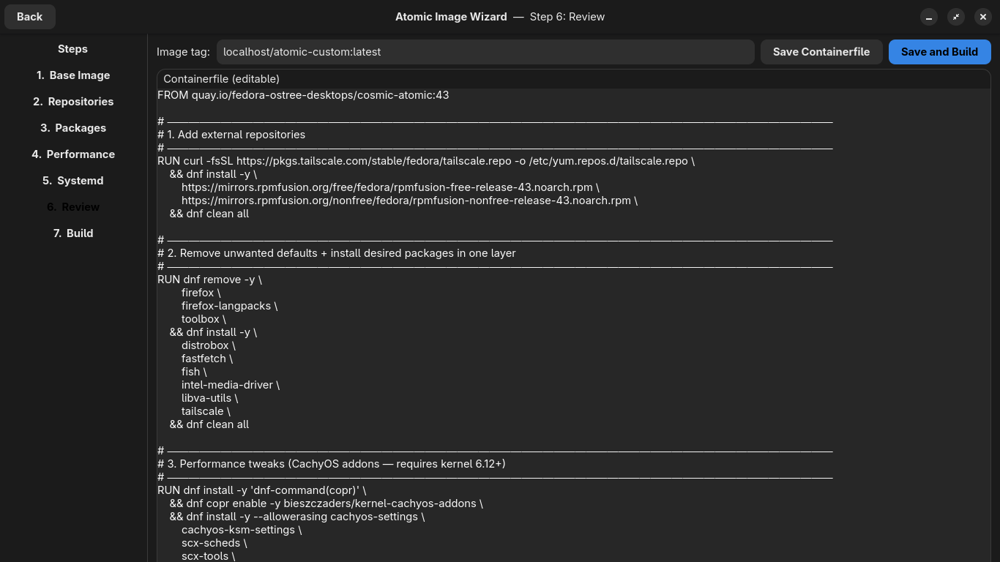

# Atomic Image Wizard

A step-by-step graphical wizard for creating custom Fedora Atomic / bootc images.

Designed for users new to atomic desktops who want to customise their system image
without writing Containerfiles by hand.



---

## Requirements

- Fedora Atomic desktop (Silverblue, Kinoite, Sericea, Cosmic Atomic, or any bootc-based spin)
- `podman` — present by default on all Fedora Atomic spins
- `bootc` — present by default on all Fedora Atomic spins
- Python 3.11+ and GTK4 — present by default on all Fedora Atomic spins
- `python3-gobject` and `gtk4` Python bindings — see note below

> **Note on PyGObject:** If the installer reports missing GTK4 bindings, add the
> following to your Containerfile and rebuild before running the installer:
> ```
> RUN dnf install -y python3-gobject gtk4 && dnf clean all
> ```

---

## Installation

Clone the repo and run the installer:

```bash
git clone https://github.com/yourusername/atomic-image-wizard
cd atomic-image-wizard
bash install.sh
```

The installer will:
- Check that all dependencies are present and give clear guidance if anything is missing
- Create `~/bootc/` — this is where the wizard and your Containerfiles will live
- Copy `atomic_image_wizard.py` and `atomic_image_wizard.svg` into `~/bootc/`
- Install the icon to `~/.local/share/icons/`
- Install a `.desktop` entry to `~/.local/share/applications/`

After installation the wizard appears in your app launcher. No terminal needed after that.

If it doesn't appear immediately, log out and back in.

---

## Uninstall

```bash
bash install.sh --uninstall
```

This removes the desktop entry and icon. You will be asked separately whether to
remove `~/bootc/` — it will not be deleted without confirmation since your saved
Containerfiles live there.

---

## What it does

Walks you through seven steps to produce a custom bootc image based on any Fedora
Atomic base:

1. **Base Image** — choose a Fedora Atomic base or enter a custom registry image
2. **Repositories** — enable RPM Fusion, Copr repos, or any custom repo setup command
3. **Packages** — search for and queue packages to install or remove
4. **Performance** — optional CachyOS kernel addons (requires kernel 6.12+)
5. **Systemd** — enable or disable services at boot
6. **Review** — edit the generated Containerfile before building
7. **Build** — build the image with podman, then deploy it with bootc

The wizard saves your Containerfile to `~/bootc/Containerfile`. On next launch it
will detect any existing Containerfile and offer to load it as a starting point for
a rebuild or modification.

---

## Current status

Early testing release. Developed and tested on **Fedora Cosmic Atomic**.

Behaviour on other spins (Silverblue, Kinoite, Sericea) may differ — particularly
around default package sets and systemd service detection. Feedback from other spins
is especially welcome.

---

## Known limitations

- Package search uses the host system's dnf cache. If searches time out or return
  no results, run `dnf makecache` in a terminal first.
- The Containerfile parser handles common patterns well but may not recognise every
  custom RUN command — unrecognised commands are flagged with a warning rather than
  silently dropped.
- Performance tweaks (CachyOS addons) require Linux kernel 6.12 or newer.
  Fedora 41 and later meet this requirement.

---

## Reporting issues

Please include:
- Which Fedora Atomic spin and version you are running
- What you were doing when the issue occurred
- The contents of your Containerfile if relevant (Review page → Copy log to clipboard)
- Any error messages shown

---

## License

MIT
